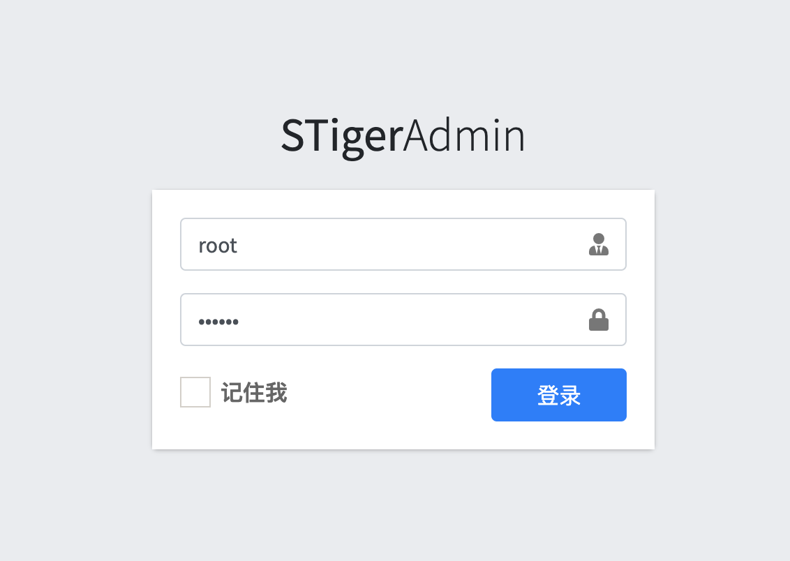
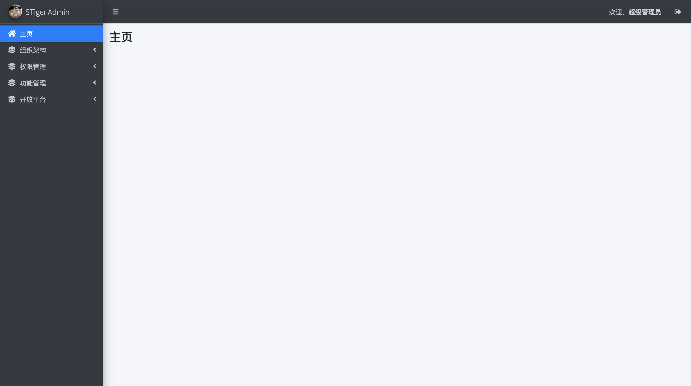
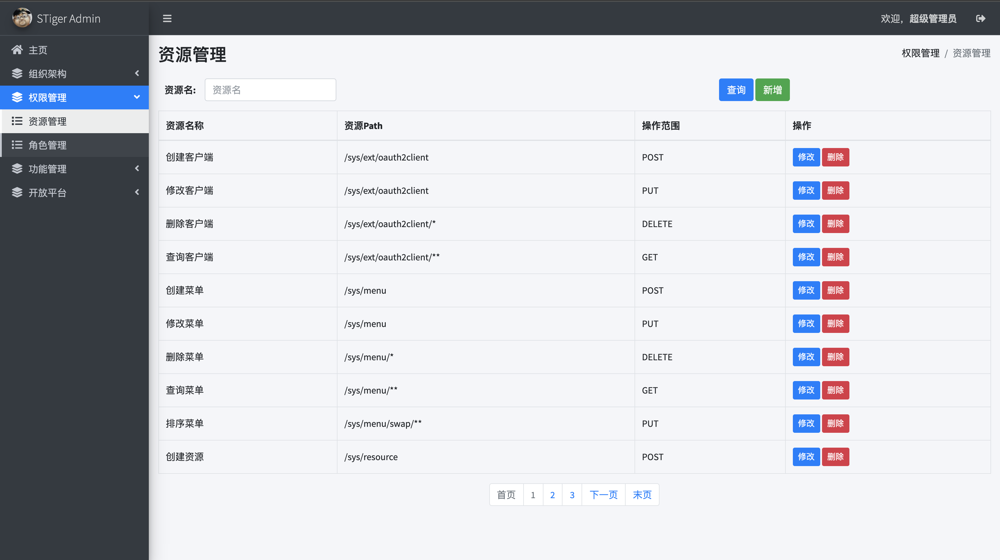
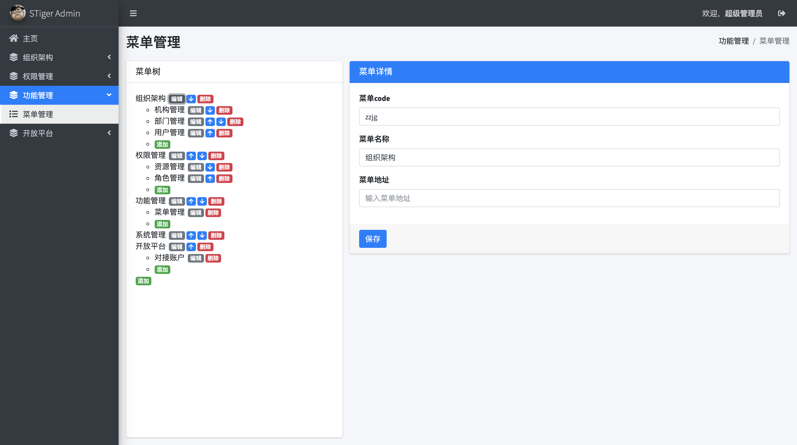
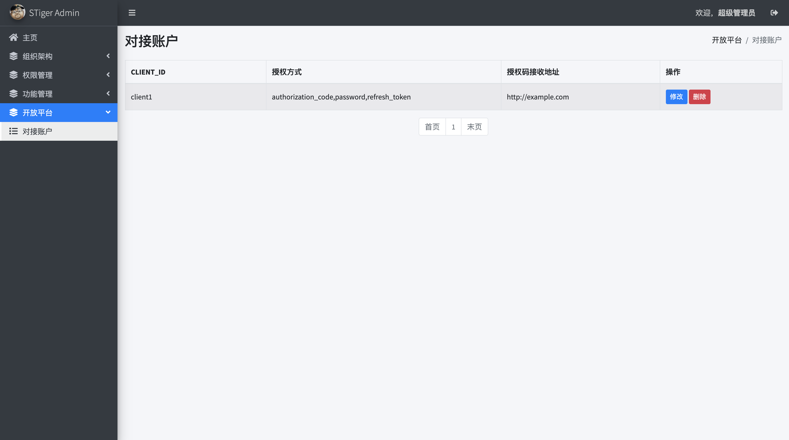
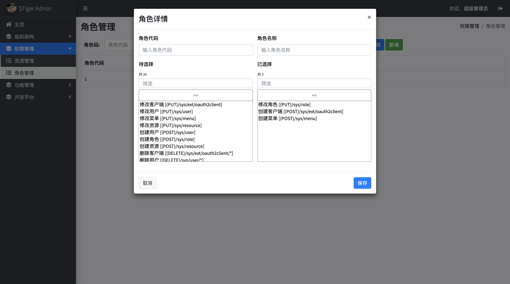
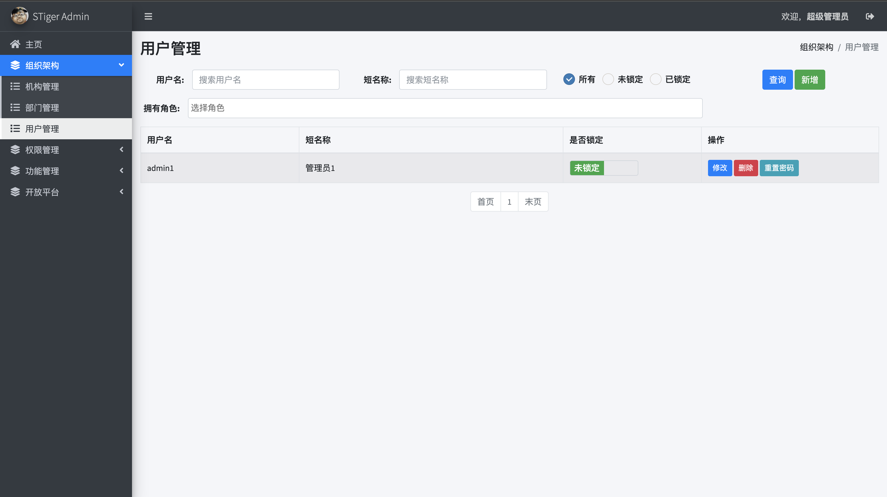

# Star Tiger Admin
```bash
                                    ,
                     A           \  :  /           A
                 ___/_\___    `. __/ \__ .'    ___/_\___
                  ',. ..'     _ _\     /_ _     ',. ..'
        A         /.'^'.\        /_   _\        /.'^'.\         A
    ___/_\___    /'     '\     .'  \ /  `.     /'     '\    ___/_\___
     ',. ..'                     /  :  \                     ',. ..'
     /.'^'.\                                                 /.'^'.\
    /'     '\              ___......----:'"":--....(\       /'     '\
                    .-':'"":   :  :  :   :  :  :.(1\.`-.
                  .'`.  `.  :  :  :   :   : : : : : :  .';
                 :-`. :   .  : :  `.  :   : :.   : :`.`. a;
                 : ;-. `-.-._.  :  :   :  ::. .' `. `., =  ;
                 :-:.` .-. _-.,  :  :  : ::,.'.-' ;-. ,'''"
               .'.' ;`. .-' `-.:  :  : : :;.-'.-.'   `-'
        :.   .'.'.-' .'`-.' -._;..:---'''"~;._.-;
        :`--'.'  : :'     ;`-.;            :.`.-'`.
         `'"`    : :      ;`.;             :=; `.-'`.
                 : '.    :  ;              :-:   `._-`.
                  `'"'    `. `.            `--'     `._;
                            `'"'
```
由 https://github.com/snake19870227/StarTiger/tree/master/StarTiger-admin 迁移至此  

**特别感谢 [Jetbrains](https://www.jetbrains.com/?from=StarTiger) 提供的License**  

### 说明
基于RABC模型的后端管理中心

依赖项目：
```xml
<parent>
    <groupId>com.snake19870227</groupId>
    <artifactId>star-tiger-framework</artifactId>
    <version>${lastVersion}</version>
</parent>
```
git仓库地址：https://github.com/snake19870227/star-tiger-framework  
**已发布至中央仓库**

### 技术栈
- mysql 5.7.29
- Spring Boot 2.2.6
- Spring Security 5.2.x
- Spring Security OAuth 2.2.6
- thymeleaf 3.x
- sharding-jdbc 4.0.1
- mybatis 3.5.3
- mybatis-plus 3.3.0
- hutool 5.1.0
- mapstruct 1.3.1.Final
- elasticsearch 7.6.2
- kibana 7.6.2
- logstash 7.6.2
- filebeat 7.6.2

### 模块
- `star-tiger-admin-common` - 功能组件模块
    - `star-tiger-admin-core` - 核心功能模块
    - `star-tiger-admin-datasource` - 数据源模块
    - `star-tiger-admin-oauth2` - oauth2授权核心模块
    - `star-tiger-admin-oauth2-authserver` - oauth2授权服务
    - `star-tiger-admin-oauth2-ui` - oauth2授权配置功能
    - `star-tiger-admin-rabc-biz` - RABC模型核心业务
    - `star-tiger-admin-security` - SpringSecurity配置模块
    - `star-tiger-admin-static` - 静态资源
    - `star-tiger-admin-ui` - RABC配置功能
- `star-tiger-admin-endpoint` - 开放接口（oauth2资源服务）
- `star-tiger-admin-monitor` - 集成SpringBootAdmin的监控模块
- `star-tiger-admin-web` - 管理功能打包模块

### 待完成（TODO）
- 完成机构、部门维护功能
- 整合SpringCloud，将`star-tiger-admin-rabc-biz`服务化
- ~~日志收集采用filebeat~~ (已完成)
- ~~增加`star-tiger-admin-monitor`资源表（`sys_resource`）初始数据，方便定义单独权限的监控服务角色~~ (已完成)
- oauth2模式scope增加至rabc模型中（维护功能）

### 部署准备
1. 授权脚本文件
    ```bash
    chmod u+x build.sh
    chmod u+x bin/*
    ```

2. `com.snake19870227:star-tiger-framework` 已发布至中央仓库，因此无需部署nexus私仓

~~2. 本地部署nexus~~  

~~3. 发布`star-tiger-framework`至本地nexus私仓~~

### Docker部署
1. mysql主从部署及配置

    - 构建主从数据库镜像并创建容器
        ```bash
        docker-compose build stiger-admin-db-master stiger-admin-db-slave1
        docker-compose up -d stiger-admin-db-master stiger-admin-db-slave1
        ```
    
    - 主从配置
        - 配置主库
            ```bash
            docker exec -i adminDbMaster13306 mysql -uroot -p123456 -e "grant replication slave on *.* to 'slaver'@'%' identified by '123456'"
            docker exec -i adminDbMaster13306 mysql -uroot -p123456 -e "flush privileges"
            docker exec -i adminDbMaster13306 mysql -uroot -p123456 -e "show master status\G"
            ```
            记录最终控制台输出的`File`与`Position`
        - 配置从库
            ```bash
            docker exec -i adminDbSlave123306 mysql -uroot -p123456 -e "change master to master_host='adminDbMaster13306', master_user='slaver', master_password='123456', master_port=3306, master_log_file='$1', master_log_pos=$2, master_connect_retry=30"
            docker exec -i adminDbSlave123306 mysql -uroot -p123456 -e "start slave"
            docker exec -i adminDbSlave123306 mysql -uroot -p123456 -e "show slave status\G"
            ```
            $1与$2分别为`File`与`Position`
    
    - 初始化数据
        ```bash
        docker exec -i adminDbMaster13306 mysql -uroot -p123456 < database/sql/sys-ddl.sql
        docker exec -i adminDbMaster13306 mysql -uroot -p123456 < database/sql/sys-dml.sql
        docker exec -i adminDbMaster13306 mysql -uroot -p123456 < database/sql/sys-ext-ddl.sql
        docker exec -i adminDbMaster13306 mysql -uroot -p123456 < database/sql/sys-ext-dml.sql
        ```
    
2. redis
    ```bash
    docker-compose up -d stiger-admin-redis
    ```
3. ELK
    ```bash
    docker-compose build stiger-admin-elastic-search stiger-admin-elastic-kibana stiger-admin-elastic-logstash
    docker-compose up -d stiger-admin-elastic-search stiger-admin-elastic-kibana stiger-admin-elastic-logstash
    ```
4. 应用
    - 监控服务
        ```bash
        mvn clean package -pl star-tiger-admin-monitor -am -P docker
        docker-compose build stiger-admin-monitor
        docker-compose up -d stiger-admin-monitor
        ```
    - 管理后台
        ```bash
        mvn clean package -pl star-tiger-admin-web -am -P docker
        docker-compose build stiger-admin-web
        docker-compose up -d stiger-admin-web
        docker exec -id stigerAdminWeb19999 filebeat -e -c /opt/filebeat.yml
        ```
    - 开放接口
        ```bash
        mvn clean package -pl star-tiger-admin-endpoint -am -P docker
        docker-compose build stiger-admin-endpoint
        docker-compose up -d stiger-admin-endpoint
        docker exec -id stigerAdminEndpoint19998 filebeat -e -c /opt/filebeat.yml
        ```

### 普通部署（不推荐）
~~1. 数据库与初始化数据~~
    ~~- 本机安装mysql~~
    ~~- 初始化数据~~  
        `mysql -uroot -p123456 < /init/sys-ddl.sql`  
        `mysql -uroot -p123456 < /init/sys-dml.sql`
    ~~- 如果需要oauth2模块~~  
        `mysql -uroot -p123456 < /init/sys-ext-ddl.sql`  
        `mysql -uroot -p123456 < /init/sys-ext-dml.sql`

~~2. redis~~  
   ~~本机安装redis~~
   
~~3. elasticsearch + kibana + logstash~~  
   ~~本地安装ELK~~

~~3. 配置文件与启动程序~~
   - ~~修改`star-tiger-admin-runtime`模块下`application-dev.yml`关于数据库连接与redis连接的配置~~
   - ~~在根目录[`star-tiger-admin`]下执行`./build.sh packdev`进行打包~~
   - ~~执行`java -jar ./star-tiger-admin-runtime/target/StarTigerAdminRuntime.jar`启动程序~~

### 页面展示

  

  

  

  

  

  

  